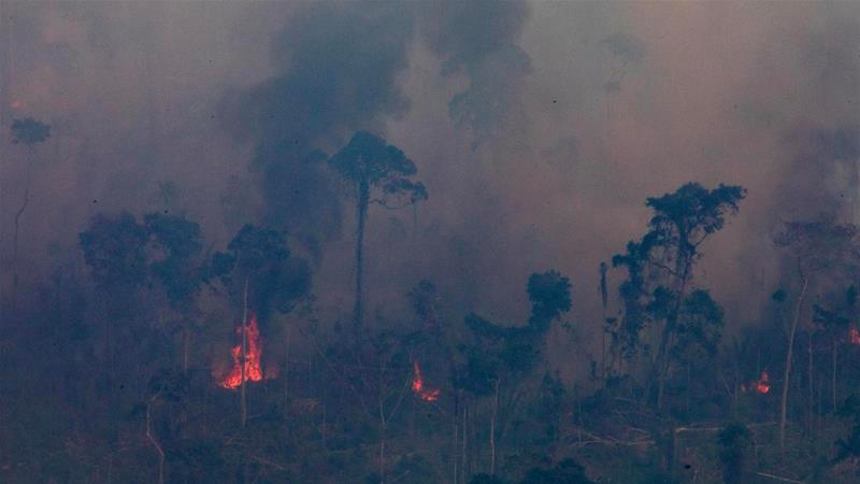
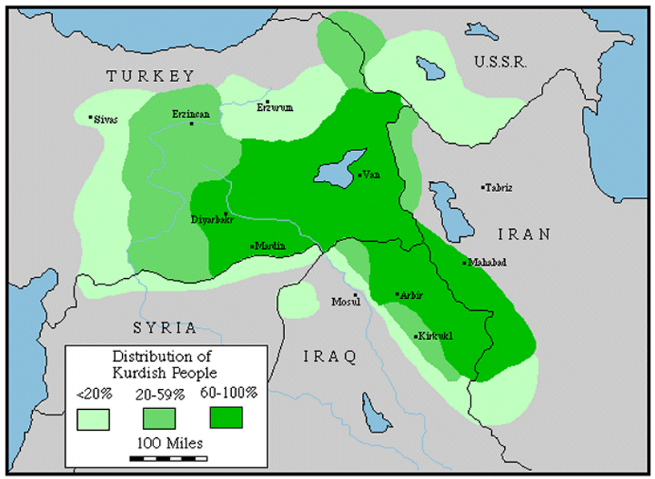

# Introduction {#intro}

> 읽을 자료  

> 1. FLS의 Introduction  

> 2. Jack Snyder의 2004년 _Foreign Policy_ 논문[^2-1], "One World, Rival Theories"

### 국제관계 (International Relations)

여기서 우리는 국제관계를 세계를 무대로 하는 정치, 세계정치(World Politics) 속에서 존재하는 정치적 단위들(political units) 간의 상호작용으로 정의한다. IR에서는 종종 주요 정치적 행위자를 국가로 가정하는데, 격변하는 세계정치 속에서 국가 외의 행위자들의 존재는 분명히 부각되고 있다[^2-2]는 점에서 그러한 가정만으로는 충분하지 않아 보인다.

#### IR이 정치학의 다른 분야와 다른 점

IR은 일단 국가 간의 상호작용을 다룬다. 이때의 상호작용이란 직$\cdot$간접적인 갈등과 협력 등을 의미하며, 구체적으로는 전쟁(Wars), 동맹(Alliances), 무역(Trade), 투자(Investment), 원조(Aid) 등의 의제들이 있다.

동시에 IR은 국가의 범주를 넘어서는 정치적 현상들에 대해서도 다룬다. 전 세계적인 수준에서 나타나는 변화를 의미하는데, 구체적으로는 금융위기(Financial crises), 인권(Human rights) 문제, 국제사법체계(international legal system)의 문제, UN이나 WTO와 같은 국제제도의 문제 등을 포괄한다.

#### 이 강의의 목표

첫째로는, 이 강의를 듣는 학생들을 세계정치라고 하는 조금은 추상적일 수도 있는 세계를 접할 수 있도록 가이드하는 것이다.



사진 출처: [링크](https://www.aljazeera.com/news/2019/08/brazil-reject-g7-offer-22m-aid-fight-amazon-fires-190827060022860.html)를 확인! 국문은 [여기](http://news.chosun.com/site/data/html_dir/2019/08/27/2019082702775.html)
더 알아보고 싶다면: [여기](https://www.bbc.com/news/world-latin-america-49479470)

위의 사진은 브라질의 아마존 열대우림에서의 화재에 관한 것이다.

  + 최근 브라질은 G7 국가들이 열대우림의 화재를 진압하기 위하여 지원하기로 한 수백만 달러의 원조에 대해 거부 의사를 밝혔다. 미국, 일본, 독일, 프랑스, 이탈리아, 영국, 그리고 캐나다는 2천2백만 달러를 지원하고자 하였고, 별개로 영국과 캐나다는 각각 1천2백만, 1천 백만달러의 원조를 약속하였다.
  + 브라질은 화재가 충분히 통제가능하다고 주장하였지만 1월부터 화재는 지속적으로 발생하고 있고,
  + 인접 국가들(볼리비아, 에콰도르, 페루, 콜롬비아, 베네수엘라)도 화재의 영향에서 자유로울 수 없는 상황이다.
  + 일련의 화재들이 브라질의 Bolsonaro 정부에 의한 환경 탈규제에 뒤따른 상업적 벌채(commercial deforestation)와 연관되어 있다고 할 때,
  + 이는 Bolsonaro가 이탈을 시사하고 있는 Paris Climate accord를 위배하고 있는 것과 같다.
  
여기에서, 행위자는 누구이고 그들의 이익은 어떻게 구성되며, 그들은 어떤 상호작용을 어떤 제도 위에서 행하고 있을까? 협력할까? 갈등할까? 그리고 어떤 분석수준이 이 의제를 이해하는 데 가장 중요할까?

둘째로 아직까지도 풀리지 않고 있는 퍼즐들에 대해 생각해볼 것이다. 왜 국가들 간에 전쟁이 발발할까? 왜 시장은 실패할까? 과연 원조는 인권의 개선에 기여할까? 인권이 침해되고 있는 국가에 왜 다른 국가들이 개입하지 않을까?

```{r plot1, eval = TRUE, echo = FALSE, results='hide'}
library(ggplot2)
library(ezpickr)
library(tidyr)
library(plyr)
warfare <- pick("Data/MEPV2012ex.xls")
warfare.sub <- subset(warfare, select = c("YEAR", "INTTOT", "CIVTOT", "ACTOTAL", "ETHWAR"))
warfare.sum <- ddply(warfare.sub, .(YEAR), summarize, 
                     sum.INTWAR = sum(INTTOT, na.rm = TRUE),
                     sum.CIVWAR = sum(CIVTOT, na.rm = TRUE),
                     sum.TOT = sum(ACTOTAL, na.rm = TRUE),
                     sum.ETHWAR = sum(ETHWAR, na.rm = TRUE))
warfare.long <- gather(warfare.sum, type, warfare, sum.INTWAR:sum.ETHWAR, factor_key=TRUE)
warfare.long$type <- ifelse(warfare.long$type == "sum.INTWAR", "Interstate Warfare",
                            ifelse(warfare.long$type == "sum.CIVWAR", "Societal Warfare",
                                   ifelse(warfare.long$type == "sum.TOT", "Warfare Totals",
                                          "Ethnic War")))
names(warfare.long)[2] <- "Type"
Plot1 <- ggplot(warfare.long[warfare.long$Type!="Ethnic War", ], 
       aes(x = YEAR, y = warfare, colour=Type)) + 
  labs(x="", y="Summed War Magnitude Scores") +  
  scale_x_continuous(breaks = seq(from = 1950, to = 2016, by = 5)) + 
  geom_point() + geom_line() + 
  theme_bw() + theme(legend.position="bottom") + 
  geom_vline(xintercept = 1992, linetype="solid", 
                color = "black", size=0.5)
```

```{r plot1_pic, echo = FALSE, fig.cap="Global Trends in Armed Conflict, 1946-2016", fig.margin=TRUE}
print(Plot1)
```

그림은 전 세계의 1946년부터 2016년까지의 무력분쟁의 트렌드를 보여주는 것이다. 국가간 분쟁, 내전, 그리고 전체 분쟁의 트렌드를 보여준다. 이 플롯을 보고도 한 가지 질문을 해볼 수 있다. 왜 글로벌 트렌드에서 전쟁이 감소하는 모습을 보일까? 그리고 왜 유형별로 감소 수준이 다를까?

```{r plot2, eval = TRUE, echo = FALSE}
polity <- pick("Data/p4v2017.xls")
polity.sub <- subset(polity, select = c("year", "polity2"))
polity.sub$democracy <- ifelse(polity.sub$polity2 > 6, 1, 0)
polity.sub$autocracy <- ifelse(polity.sub$polity2 < -5, 1, 0)
polity.sub$anocracy <- ifelse(polity.sub$polity2 > -6 & polity.sub$polity2 < 7, 1, 0)
polity.sum <- ddply(polity.sub, .(year), summarize, 
                     sum.d = sum(democracy, na.rm = TRUE),
                     sum.ac = sum(autocracy, na.rm = TRUE),
                     sum.an = sum(anocracy, na.rm = TRUE))
polity.long <- gather(polity.sum, Regimes, Numbers, sum.d:sum.an, factor_key=TRUE)
polity.long$type <- ifelse(polity.long$Regimes == "sum.d", "Democracies",
                            ifelse(polity.long$Regimes == "sum.ac", "Autocracies", "Anocracies"))
Plot2 <- ggplot(polity.long, aes(x = year, y = Numbers, colour=type)) + 
  labs(x="", y="No. of Countries (Population > 0.5M)") +  
  scale_x_continuous(breaks = seq(from = 1800, to = 2018, by = 20)) + 
  geom_point() + geom_line() + 
  theme_bw() + theme(legend.position="bottom") + 
  geom_vline(xintercept = 1992, linetype="solid", 
                color = "black", size=0.5)
```

또, 우리는 국가를 넘어선 국제체제 수준의 설명에 대해서도 생각해볼 수 있다.: 민주주의 대 권위주의의 비율(어떤 체제의 국가가 더 많은가)이 분쟁 발발 수준에 영향을 미칠까?

```{r plot2_pic, echo = FALSE, fig.cap="Global Trends in Governance, 1800-2018", fig.margin=TRUE}
print(Plot2)
```

이러한 변화를 추동하는 원인은 대체 무엇일까?

셋째로 우리는 단순하게 어떠한 현상을 서술하는 것을 넘어서 그것이 왜 나타났는지를 이론과 분석을 통해 이해하고자 한다. 이를 위해 우리는 다양한 개념들을 사용하게 될 것이다: 전략적 행태(strategic behavior), 거래(bargaining), 협력(cooperation), 정치적 생존(political survival), 그리고 집단행동의 문제(collective action problems) 등.

  + 거래(bargaining)이란 쉽게 말해 제로섬 게임을 생각하면 된다. 거래를 할 가치의 총합이 정해져 있고, 그걸 사이에 두고 각 행위자가 상호작용을 통해 자신의 몫을 추구하는 것이다. 따라서 한 명이 무언가를 얻게 된다면, 그것은 다른 행위자에가 무엇인가를 잃었다는 것을 의미한다.
  
  + 협력(cooperation)은 최소 한 명의 행위자가 상호작용을 통해 현상유지보다 나은 몫을 가지게 되는 것을 의미하며, 이때 누구도 협력 이전보다 상황이 악화되지는 않는다는 것을 전제로 한다.
  
#### 정치란 무엇인가?

좀 더 크게 한 번 들어가서, 정치란 무엇인지 얘기해보자. 이 강의의 대전제로 정치(politics)란 사회 내에서 누가 무엇을 갖는지를 결정하는 과정을 의미한다. 여기서 조금 확장해보면 두 가지 질문이 가능하다. 국가라는 기준을 놓고, 국가 내 정치와 국가 간 정치의 영역이 있다고 할 때, 각자의 영역에서 '결정자'가 누구냐는 질문을 해볼 수 있다.

  + 국가 내 정치 vs. 국가 간 정치
  + 국가의 정부 vs. ???
  
물음표로 적은 이유는 다름이 아니라, 국제관계에서 어떤 국가가 무엇을 가질지, 혹은 포기해야할지를 강제하는 제도적 구조가 부재하기 때문이다. 이러한 상태를 IR 학자들은 무정부 상태(Anarchy)라고 정의하고 있다. FLS의 내용을 다루는 뒷부분에서 좀 더 자세히 다루겠지만, 여기서는 IR 개관을 본격적으로 다루기 전에 몇 가지 정의(definitions)를 선행하고 가도록 하자.

##### Nations vs. States

이건 한글로 적기 애매해서 그냥 영어로 적었다. 굳이 표현하자면... 민족과 국가? 사실 한국인들에게는 조금 생소한 개념일 수 있다. 우리나라는 쉽게 찾아보기 힘든 민족성과 국가정체성이 상당 부분 일치하는 민족-국가(nation-state)를 구성하고 있기 때문이다. 단일민족, 한민족이라는 말이 그다지 어색하지 않은 것만 봐도 그렇다. 하지만 이 둘은 분명한 차이가 있다.

  + Nations (민족): 국경을 넘어서 정체성과, 문화 등을 공유하고 있는 개개인들의 집합
    + 민족은 물리적 지형에 구애되지 않으며 반드시 국가와 일치할 필요는 없다.
    + 예를 들어, 쿠르드 민족은 국가 없이 터키, 이란, 이라크 일부 지역에서 존재하고 있다.
  + States (국가): 단 하나의 민족을 가질 필요는 없으며, 영토적 경계를 가진다.
    + 이라크는 수니파, 시아파, 그리고 쿠르드족의 다양한 민족으로 구성된 국가이다.
    + [그림](http://www.globalsecurity.org/military/world/war/images/dist-kurdish.gif)을 참고.



그럼 여기서 주권(Sovereingty)의 논의로 넘어가보자.

##### 주권의 기원 (Origins of Sovereignty)

민족, 국가, 혹은 민족국가 모두 IR에서 국가로 정의되는 단위는 주권을 갖는다. 이 주권은 1618년부터 1648년까지 지속된 30년 전쟁의 결과로 수립된 것이다. 이 전쟁이 종결되며 형성된 웨스트팔리아 체계는 구 가톨릭 세력을 대변하던 가톨릭 교회와 합스부르크 왕가 세력이 결국 신교 세력과 독일의 제후들과의 전쟁에서 합의를 함으로써 기존에 가톨릭 교회가 가지고 있던 조세권 등을 국가 단위로 귀속시키는 결과를 가져왔다. 따라서 이 행위자들의 이익의 문제는 조세권과 국가 영토(bounderies)를 결정하는 문제였고, 그 결과 더 이상 각 국의 사정에 타국이 함부로 개입하지 못하는, 근대 주권국가의 체계가 수립된 것이다.

1648년 웨스트팔리아의 평화로 찾아온 이 주권체계는 대내적, 대외적 측면에서 이해해볼 수 있다. 대내적으로 주권은 해당하는 영토에 대한 최우선적이고 최고의 통제권을 의미하며, 대외적으로 그것이 다른 국가들에 의해 인정되는 권리를 의미한다. 

##### 무정부 상태

그럼 다시 무정부 상태로 돌아와보자. 무정부 상태란, 이러한 주권개념의 결과로 나타난 것이다. 모든 국가들의 주권이 존중받아야하는 만큼, 다른 국가를 강제할 수 있는 수단은 부재하게 된 것이다. 즉, 국가 위의 국가란 존재하지 않게 되었다.

따라서 우리는 국가들이 각자 어떠한 제도에 기초하여 의사결정을 하고 있는지에 대해서도 주요하게 살펴볼 필욕 있다. 다만, 제도에 대해서는 아직 정치학 영역에서 합의된-권위있는-단 하나의 정의는 존재하지 않는 것 같다. Keohane, Krasner 등이 말하는 IR에서의 제도, 레짐의 개념과 또 CP에서의 개념이 또 다르다.

#### 그럼 대체 IR 학자들은 뭘 하는건가?

이론적 관점에서 국제적 행위자들(international actors)이 어떻게 행위하는지에 대한 인과적인 주장을 제시한다.

  + 인과적 주장이란 단지 그 현상이 어떠한 것이라고 기술할 뿐 아니라 어떻게 그러한 현상이 나타나게 되었는지 설명하고, 어떤 현상이 나타날 것이라고 예측하는 진술을 의미한다.
  
우리는 국가를 이끄는 지도자들이 기본적으로 자기 자리를 보전하고자 하는 욕망에 따라 움직이는 합리적 행위자(rational actor)일 것이라고 기대한다.

  + 그러므로 그런 행위자들은 (i) 국내적 이익, (ii) 제도에 의해서 영향을 받는다.

동시에 지도자들은 대외적으로도(abroad) 전략적으로 행동할 것이다.

  + 다른 국가들이 어떻게 행동할 것인지에 대한 기대가 존재할 것이며,
  + 이 경우에도 마찬가지로 국제적 제도들에 의해서 영향을 받을 것이다.
  
학자들은 동시에 이러한 주장들을 경험적으로 검증하고자 한다.

  + 검증이란 실제 세계에 대한 근거를 바탕으로 이론적 주장을 지지 혹은 기각하고자 하는 것이다.
  
이러한 주장들은 때론 대외정책에 있어서도 적절하게 반영되고는 한다. 그럼 대체 이론이란 뭔지, 한 번 자세하게 들어가보자.

### 이론 (Theory)

이론이란 우리가 관심을 갖는 현상을 설명하는 논리적으로 인관된 진술들의 집합이다. 구체적으로는 어떤 현상(IR이니까 전쟁, 국제협력 등?)이 나타나게 된 원인들에 대한 잠정적인 추측들이라고 할 수 있다.

  + 이론은 우리가 관심을 가지고 있는 국제적 현상이 나타나는데 중요한 역할을 한 인자(facotrs)가 무엇인지를 특정한다.
  + 그리고 이러한 인자들을 한 데 모아놓았을 때, 어떻게 연구퍼즐을 설명하는지를 보여준다.
  + 이론은 왜 그 현상이 발생하였는지, 그리고 어떤 조건이 현상의 발생하는 정도에 영향을 미치는지를 규명한다.
  + 이론은 설명 이외에도 몇 가지 다른 기능들을 수행한다.
    + 서술(description): 이론은 어떤 요인들이 중요한지, 중요하지 않은지를 규정함으로써 그 사건이 어떠한 사건인지를 서술한다.
    + 예측(prediction): 어떻게 세계가 돌아가는지, 한 요인의 변화가 행위와 결과에 있어서 어떤 변화로 이어지는지를 설명의 원인을 통하여 미래의 결과를 제공한다.
    + 처방(predescription): 더 나은 결과를 가져오기 위해 어떠한 변화가 이루어져야 하는지를 규명하는 정책적 대응이다.
  + 이론은 복잡한 현생에 대해 간략화된, 다루기 쉬운 설명들을 제공한다.
    + 원인(예측변수들; predictors, independent variables)이 결과(outcomes, dependent variables)에 미치는 영향/관계를 본다.

다만 자연과학과 달리 사회과학의 연구 대상인 사회는 끊임없이 변화한다. 따라서 우리는 단정적 이론을 구축할 수 없다. "모든 단일 사례에 들어맞는 일반화된 설명은 없다." 결국 우리는 특정한 결과가 발생할 가능성을 높이거나 낮추는 요인들에 대한 확률적 주장, 확률적 설명을 하게 된다.

  + 즉, 사회과학이론은 단정적/결정적이라기보다는 확률적인 진술로 구성된다.
  + 그리고 대개는 다변량의 형태를 취한다: 여러개의 예측변수들을 가지고 결과와의 관계를 본다.
    + 다른 모든 조건이 일정할 때~ 라는 조건을 취한다.
    + 왜? 실제 세계는 실험실과 달리 단 하나의 인자가 결과에 미치는 효과를 독립적으로 떼어내어 볼 수 없으니까.
  + 이러한 노력은 우리로 하여금 경험적인 사실들(empirical facts) 간의 관계를 도출하는 데 도움을 준다.

우리는 여러 가지 방법들을 이용하여 우리의 가설을 검증한다.

  + 정량적인 사례연구(case study), 소규모(small-n)-대규모(large-n) 정량연구 등

## 분석틀: 이익, 상호작용, 그리고 제도

분석틀은 세계정치에 대해 생각하는 한 방식으로 연구퍼즐과 관련하여 이론을 구축하는 데 유용하다. 우리는 세 가지 핵심 개념(이익, 상호작용, 제도)을 가지고 분석틀을 구성한다.

  + 이익 (Interesets): 행위자들이 가지고 있는 목표이며, 정치적 행동을 통해서 획득하고자 하는 결과이다.
  + 상호작용 (Interactions): 둘 이상의 행위자들이 정치적 결과를 생산하기 위해 선택하는 방식의 결합. 
    + 즉, 둘 이상의 행위자들이 어떤 결과를 얻기 위해 서로 행동하다가 교차하면, 그게 상호작용이라고 할 수 있다.
    + 우리가 관측하는 결과들은 각자 자신의 이익을 추구하는 많은 행위자들의 선택을 반영하고 있을 뿐 아니라 그들의 이익과 다른 사람들의 행동 가능성을 설명하기도 한다.
  + 제도 (Institutions): 정치적 상호작용을 구조화하는 일련의 규칙들이다. 그리고 그 규칙들은 공동체 안에서 알려지고 공유된 것이다.
    + 제도는 게임의 규칙으로 정의되며, 공식 조약과 법규, 또는 UN과 같은 단체들에 포함된다.
    + 제도는 순응 여부를 감시하거나 규칙을 위배한 이들을 처벌하는 기능을 수행하기도 한다.
  
이 책에서 사용하는 세 가지 개념을 중심으로 짜여지는 분석틀은 유연하고, 실용적이며, 개방적이다. 분석틀은 어떠한 이익, 상호작용, 그리고 제도가 중요한가에 대한 다르게 가정하더라도 적용가능하다.
  
  + 이론은 우리가 설명하고자 하는 사건, 혹은 사건의 패턴과 관련된 특정한 이익, 상호작용, 그리고 제도를 규정할 때 나타난다. 즉, 무엇을 연구할지, 그리고 그 대상을 설명하기 위한 주요 개념을 정의할 때, 그것들이 논리적으로 연결될 때 이론의 모습으로 나타난다.
    + 그리고 이러한 이론들이 마땅히 그러해야하는 것으로 규정하는 개념들은 '가정된다.'
    + 가정의 수정이란? 예를 들어, 때때로 국가들은 목표를 추구하는 행위자들처럼 간주되는 것이 유용하다. 이때의 목표는 권력, 안보, 또는 영토 확장과 같은 것들이 될 수 있다.
    + 우리는 가정이 연구퍼즐을 설명하는데 유용한지, 유용하지 않은지의 여부만을 판단한다.
  + FLS는 두 가지 유형의 상호작용에 초점을 맞춘다.
    1. 거래 (Bargaining): 둘 이상의 행위자가 다른 상대방에 대해 우위를 점하는 결과를 선택해야 하는 상호작용의 유형. 제로섬 게임이라고 생각하면 편하다. 서로 다른 행위자들이 한정된 가치를 분배하는 문제로, 내가 얻으면 상대방이 잃는 상황에서 나타난다.
    2. 협력 (Cooperation): 행위자들이 공통의 이익을 가지고 그 이익을 달성하기 위해 조정된[^2-3] 방식의 행동을 필요로 할 때 나타난다. 누구도 상황이 악화되지 않는 상황 하에서 현상유지에 비하여 최소 한 사람이라도 개선된 결과를 갖게끔 하는 정책적 상호작용을 의미한다.
  + 보면 알겠지만, 거래와 협력은 정치적 삶(political life)의 일상에서 나타난다.
  
FLS는 또 국내 수준의 제도에 초점을 맞추기도 한다. 즉, 누가 그 국가를 통치하는지, 어떻게 의사결정이 이루어지는지 등을 살펴보는 것이다.

  + 국내 정치제도는 어떤 행위자들이 권력에 접근성을 가질지, 그리고 정책결정과정이 어떻게 이루어질지에 영향을 미친다.
  + 국내 정치제도의 차이는 세계정치에 큰 영향을 미치기도 한다.
  + 여기서 분석수준의 문제가 나타난다.
  
### 분석 수준 (Level of Analysis)

세계정치 내에서는 다양한 행위자들이 활동하고, 제도들이 작동하고 있다. 즉, 이는 우리가 다음의 세 수준에서 나타나는 중요한 상호작용들을 눈여겨 볼 필요가 있다는 것을 의미한다. 사실 분석수준이라고 하면 국가 단위, 국가 하위의 단위, 혹은 한 국가의 시간의 흐름에 따른 변화(time-series), 국가-연도 별 변화, 개인(individuals), 혹은 거대한 국제체계 등 매우 다양하다. 그리고 어느 수준에서 분석 수준을 설정할 것인가는 분석의 결과를 어느 수준에까지 일반화할 수 있는가와 밀접하게 관련되어 있다. 단, FLS에서는 분석수준을 세 층위로 나누어서 다음과 같이 구분하고 있다.

  + 국제적 수준 (international level)
    + 서로 다른 이익을 가진 국가의 대표들이 상호작용
    + UN이나 WTO 같은 국제제도의 맥락에서 상호작용을 하고는 한다.
  + 국내적 수준 (domestic level)
    + 서로 다른 이익을 가진 국가 하위의 행위자들이 상호작용
    + 정치인, 관료, 기업, 노동조합, 유권자 등
    + 국가의 대외정책 선택을 결정하는 국내 제도 내에서 상호작용
  + 초국가적 수준 (transnational level)
    + 국경을 넘어선 구성원들을 가진 단체들
    + 다국적 기업, 초국적 옹호 네트워크, 테러집단
    + 이러한 단체들은 국내정치와 국제정치 모두에 걸쳐 영향력을 행사하고자 하는 이익을 추구
    + 따라서 초국가적 행위자들은 모든 수준에 영향
    
이 세 수준은 상호연계되어 있다. 따라서 어떤 단 하나의 분석수준이 다른 수준들에 비해 우위에 있다거나 하는 것은 아니다. 오히려 FLS는 연구문제를 풀기 위한 유용한 설명을 구축하기 위한 2단계의 상향식 방식을 제안한다.

  1. 국내 수준의 이익, 상호작용, 그리고 제도는 국제관계에서 활동하는 국가 대표들[^2-4]의 이익을 결정한다.
  2. 이러한 이익들은 국제적 상호작용과 제도 속에서 서로 결합하여 최종 결과물로 이어진다.
    
### 현실주의, 자유주의, 그리고 구성주의

국제관계 연구는 크게 세 가지 사조/학파로 분류되고는 한다. 이 세 가지 '-주의'들은 국제정치의 속성에 대해 서로 다른 세계관을 대표한다. 각각의 학파는 세계정치를 이해하는 데 가장 중요한 이익, 상호작용, 그리고 제도를 가정하는 데 있어서 서로 차이를 보인다.

#### 현실주의 (Realism)

현실주의의 관념은 다음과 같은 이들의 저작에서 찾아볼 수 있다.

  + 투키디데스 (BC 460-400)
  + 마키아벨리 (1469-1527)
  + 홉스 (1588-1679)
  + 장자크 루소 (1712-1778)
  
현실주의는 두 가지 핵심가정에서 출발한다.

1. 국가는 국제관계에서 주도적인(dominant) 행위자이다.
2. 세계정치의 제도적 설정(setting)은 무정부 상태(anarchy)로 특징지어진다.

  + 무정부 상태: 
  
    1. 국제체제에서 중심이 되는 권위체가 부재한 것을 의미한다. 
    2. 시민들을 통치하는 정부가 있는 개별 국가들과는 달리, 국제관계에서는 국가들을 규율하는 세계정부는 존재하지 않는다.
    
  + 현실주의자들은 무정부 상태가 세계정치에서 중요한 이익과 상호작용을 형성한다고 가정한다.
  
    + 국가들은 항상 서로에 대한 지속적인 공포 속에서 살아가야만 한다.
    + 논리는 직관적이고 단순하다. 군사력 사용을 단속할 수 있는 외부의 권위체, 제약이 전무한 상황에서 모든 국가들은 최우선적으로 자국의 생존과 안보를 추구하게 된다.
    + 따라서 국가들은 안보(security)에 이익을 갖게 되고, 그 이익은 다른 어떤 이익에 우선한다.
      + 국가가 안전하지 않다면 다른 어떤 목표도 현실화될 수 없기 때문이다.
      + 현실주의는 국가가 안전해지기 위해서 필요한 것을 '권력'(power)라고 이해한다.
      + 특히 그 권력은 군사적 역량(military capabilities)에 초점을 맞추고 있다.
    + 권력에 대한 요구는 필연적으로 국가들 간의 이해관계를 갈등 상황으로 밀어넣게 된다.
      + 한 국가가 안보 증진을 위해 군사력을 증강하면 그것은 필연적으로 이웃국가의 안보를 저해하게 되고, 이에 이웃국가가 다시 군사력을 증강하는 쳇바퀴의 문제 $\rightarrow$ 안보딜레마(security dilemma)
  
  + 현실주의자들이 보는 국제관계의 자연상태(state of nature)는 만인의 만인에 대한 투쟁으로 정리해볼 수 있다.
    + 국가들의 대개의 상호작용이란 거래(bargaining)와 강압(coercion)에 관련된 것이다.
      + 어떤 한 국가의 이익은 다른 한 국가의 손해와 연결된다: Zero-sum game
      + 현실주의자들은 협력을 통해 얻을 수 있는 잠정적 이익이 큳라도, 국가들은 이익의 총량보다 각자에게 돌아가는 혜택의 상대적 몫을 ㄷ 우려한다.
      + 결과적으로 국가들은 자기가 상대방보다 열위에 놓일 것을 걱정해 호혜적인 교환도 꺼리게 된다.
    + 협력은 어렵고, 거의 나타나지 않는다.
    
  + 국제관계의 무정부성 때문에 국제제도들의 역할은 약하고, 세계정치에 있어서 독립적인 영향력을 거의 행사하지 못한다.
    + 국제제도들은 강대국의 이해관계를 반영한다.
    + 어떨 때는 중요한 역할을 할 수도 있지만, 결국에 국가들은 자기이익과 권력에 따라 행동하게 될 것이다.
    + 국내외의 제도들은 지속적인 평화를 가지고 오지 못한다.
      + 전쟁은 외교 및 일시적 동맹을 통해서만 관리될 수 있다.
    + 종종 경제학자들은 자유로운 상업이 국가들의 관계를 개선할 수 있을 것이라고 기대한다.
    + 하지만 현실주의자들은 무역과 자본 흐름에 대한 규제가 국가의 상대적 권력을 제고, 또는 유지하기 위한 지표라고 이해한다. $\rightarrow$ 즉, 흐름이 자유로운 것에 초점을 맞추기보다는 그 와중에 행해지는 규제를 국가 간 권력의 이슈로 들여다본다.

#### 자유주의 (Liberalism)

 자유주의의 관념은 다음과 같은 이들의 저작에서 찾아볼 수 있다.

  + 존 로크 (1632-1704)
  + 임마누엘 칸트 (1724-1804)
  + 아담 스미스 (1723-1790) \& 데이비드 리카르도 (1772-1823)[^2-5]
  + 장자크 루소 (1712-1778)

자유주의는 이 책이 취하는 접근법과 가장 밀접한 사조(strand of thoughts)이다. 자유주의 이론가들은 세계정치에서 다양한 서로 다른 수준의 행위자들이 중요하다고 인정한다.

  + 개인, 기업, 비정부단체, 국가 등 이들 모두가 국제관계에서 일익을 담당하고 있다고 본다.
  + 어떤 하나의 이익이 다른 이익보다 우위에 있다고 가정하지 않고, 행위자의 목표에 대해서도 현실주의보다 유연하게 간주한다
    + 현실주의는 안보/권력 추구만이 최우선 이익이라고 본다.
  + 자유주의자들은 국내 정치제도 내에서 활동하는 서로 다른 국내 행위자들의 상호작용으로부터 정부의 이익이 비롯된다고 주장한다.
  + 종종 행위자들을 부를 극대화하고자 하는 존재(wealth maximizer)로 묘사하기도 한다.
  + 세계정치/국제관계에서의 협력 가능성에 대해 낙관적인 태도를 보인다.
    + 행위자들이 많은 분야에서 협력의 근간이 될 수 있는 공통의 이익을 가질 수 있다고 본다.
    + 국가들은 갈등을 회피하고자 하는 공통의 이익을 가진다.
  + 국경에 걸쳐 재화와 돈의 흐름이 가능하게끔 장벽을 낮추는 것과 국제 거래를 촉진하기 위한 제도를 만드는 것은 이윤이 되는 교환을 제고할 수 있다는 점에서 공통의 이익이라고 할 수 있다.
  + 행위자들이 더 나은 공통의 이익을 위해 협력할 수 있을 것인가의 문제는 국내외 제도들에 의해 좌우된다.
    + 국내 제도 수준에서,
      + 자유주의자들은 민주주의 하에서 이익의 조화를 암묵적으로 반영하는 정부의 대외 정책으로 이어질 것이라고 본다
      + 거칠게 일반화하자면, 민주주의 $\rightarrow$ 개인의 재산권/자유 보장 $\rightarrow$ 선거로 인한 표심 고려 $\rightarrow$ 권위주의보다 협력 친화적 제도
    + 국제 제도 수준에서,
      + 협력의 범위는 제도에 대한 수요에 좌우된다.
      + 자유주의는 국제제도가 국가들 간 전략적 상호작용에서 나타날 수 있는 딜레마를 해결하고 국가들로 하여금 집단적 결정을 용이하게 함으로써 협력을 증진시킨다고 본다.
      + 세계는 진보하고 있다는 관점

#### 구성주의 (Constructivism)

구성주의의 관념은 다음과 같은 이들의 저작에서 찾아볼 수 있다.

  + 피터 카젠슈타인, 존 러기, 그리고 알렉산더 웬트 등이다.[^2-6]
  + 보면 알겠지만 다른 두 사조에 비하여 상대적으로 최근에 체계가 잡혔다.

구성주의는 자유주의처럼 세계정치/국제관게에서 행위자와 이익의 다양성에 초점을 맞추고 있다.

  + 구성주의자들은 국제제도는 유효할 뿐 아니라 행위자와 이익을 변화시키는 힘이 있다고 믿는다.
  + 이익의 물리적 측면(예를 들어, 물질적 부)보다는 비물질적 요인(예를 들어, 관념/문화/규범)의 역할에 초점을 맞추고 있다.
  + 행위자들이 원하는 것은 고정되고 미리 결정된 것이 아니다. 
    + 그러나 행위자들이 살아가고 있는 문화, 그들 사이에 널리 퍼진 관념, 그리고 정체성 또는 그들이 누구인가에 대한 개념은 고정적이다.
    + 국가들이 공통적인 혹은 상충되는 이익을 인식하는지 여부는 그들이 공통의 정치/문화적 정체성을 공유하고 있는지에 좌우된다.
    + 구성주의의 한 지파는 규범의 역할, 또는 권리와 의무라는 측면으로 정의된 행위의 준거를 강조한다.
  + 구성주의는 행위자들이 자신이 누군지, 혹은 타인이 나를 어떻게 보았으면 하는지에 대한 개념을 바탕으로 그들 자신이 믿는 옳고 그름을 추구한다고 가정한다.
    + 요컨대, 어떤 행위자의 경우는 특정한 행태 규준에 순응하고자 하는 욕망이 다른 이익들을 압도할 수 있다는 것이다.
      + 새치기를 하면 빠르게 표를 살 수 있지만, 그래서는 안 된다는, 질서를 지켜야 한다는 순응의 욕구가 그 이익보다 위에 있을 수 있다.
    + 구성주의자들이 보았을 때, 제도는 행위에 맞는 규칙을 포괄하며, 행위/관측된 결과들에 대해 큰 영향력을 행사한다.
      + 국제제도에 대한 순응은 그렇게 '순응적으로 보이고자 하는' 구성원들의 욕구에 좌우된다.
      + 옳은 혹은 적절한 행위에 관한 관념은 변화할 수 있기 때문에, 구성주의자들은 변화를 위한 중요한 잠재적 요인에 초점을 맞춘다.
      + 행위자들이 그들의 이익을 다르게 이해한다면, 적절한 행동의 개념 역시도 변화할 수 있다.
      + 구성주의자들은 "타인의 행태를 변화시키는/변화시킬 수 있는" 초국가적 행위자들의 역할에 대해서도 특히 강조한다.

위와 같은 관점/접근법/이론들은 어디까지나 우리가 실제로 살아가고 있는 세계를 얼마나 잘, 밀접하게 서술하는가에 따라서 판단되어야 한다. 각자의 사조는 세계정치를 이해하는 데 있어서 나름의 지혜를 제공한다. 그러나 이 세 접근법들은 각자 어떤 이익, 상호작용, 그리고 제도가 중요한가에 대한 견고한 가정을 수립한 결과로 지적 순수성(intellectual purity)을 얻었지만 그 대가로 설명력과 유연성의 일부를 희생하고 있다. 따라서 우리는 어떤 접근법, 혹은 이론의 옳고 그름에 집착할 것이 아니라 우리가 풀고자 하는 연구문제, 세계정치/국제관계의 현상을 이해하는 데 도움이 되는 접근법을 이익, 상호작용, 그리고 제도에 관한 가정들을 검토하여 취사선택할 필요가 있다.
  
|          	| 이익 	| 상호작용 	| 제도 	|
|-----------|---------------------------------------------------------------------------------------------------------------------------------------------------------------------------------------------------------------------	|-------------------------------------------------------------------------------------------------------------------------------------	|----------------------------------------------------------------------------------------------------------------------------------------------------------------------------------------------	|
| 현실주의 	| 국가는 주도적인 행위자이다. 국가는 안보 그리고/또는 권력을 추구한다. 일반적으로 국가의 이익은 서로 충돌한다. 	| 국제정치는 강압(coercion)의 가능성이 상존하는 거래의 장이다. 	| 국제체제는 무정부상태이며, 제도는 거의 독립적 효과를 행사하지 못한다. 국제정치는 강대국의 이익을 반영한다. 	|
|           ||||
| 자유주의 	| 여러 유형의 행위자들이 존재하며, 그들 모두 중요하다. 부(wealth)는 많은 행위자들의 공통된 목표이다. 행위자들은 종종 협력의 기반이 되는 공통의 이익을 가진다. 	| 국제정치는 협력의 확장된 영역이다. 갈등은 불가피하지만 행위자들이 공통의 이익을 인지하거나 행동하는 데 실패했을 때에 나타나는 것이다. 	| 국제제도는 규칙을 설정하고, 정보를 제공하고, 집단의사결정을 위한 절차를 만듦으로써 협력을 촉진하는 것이다. 민주주의적 정치제도는 개개인의 공통된 이익을 반영하는 국제정치의 영역을 증대시킨다. 	|
|           ||||
| 구성주의 	| 여러 유형의 행위자들이 존재하며, 그들 모두 중요하다. 행위자들의 이익은 문화, 정체성, 그리고 많은 이들이 공유하는 관념에 의해 영향을 받는다. 행위자들은 선택은 종종 이익보다 적절한 행위에 관한 규범을 반영하고 있다. 	| 상호작용은 행위자들이 특정한 이익을 갖게끔 사회화하나 그 이익은  이익에 대한 대안적인 이해가 등장함에 따라 변화할 수 있다. 	| 국제제도는 정체성을 정의하고 정의롭고 적절한 행동에 대한 규범을 통해 행동을 형성한다. 	|
Table: 현실주의, 자유주의, 그리고 구성주의


## 하나의 세계, 경쟁 이론들 (One World, Rival Theories)[^2-7]

> 국제관계에 관한 연구는 우리에게 어떻게 세계가 돌아가는지를 말해주고자 한다... 급변하는 세계에서도 전통적인 이론들은 여러 가지를 우리에게 말해주고 있다.
> ---Jack Snyder
  
Jack Snyder (이하 Snyder)는 이 짧은 페이퍼를 통하여 FLS와는 조금 다른 논조로 국제관계를 바라보는 주요 시각들(관점들)을 사건들과 연계하여 설명하고 있다. 페이퍼가 시작할 무렵의 그의 질문은 다음과 같다, "9.11 테러는 이론의 실패, 나아가 우리의 지성과 정책의 실패를 보여주는가?"

학계는 그간 급격한 변화보다는 기존 이론들로 새로운 현실을 설명하는 끊임없는 수정의 과정을 거쳐왔다. 이렇게 자리잡은 세 주요 접근법이 바로 FLS에서도 살펴보았던 현실주의, 자유주의, 그리고 구성주의다.[^2-8]

대단하신 학자 Walt께서는 이 주요 접근법에서 나온 이론들이 공적 논의와 정책적 분석 모두를 형성하고 있다고 주장하였다.

  + 현실주의는 국가들 간의 권력 배분의 변화에 초점을 맞추고
  + 자유주의는 민주주의 국가들의 수가 증가하는 것과 민주주의로의 체제변동을 강조하고,
  + 관념론은 주권, 인권, 그리고 국제적 정의와 정치에 있어서의 증가하는 종교적 관념의 유효함을 제시해왔다.
  
이런 지적 전통들은 비단 대학 강당을 넘어서 현실 세계의 정책고안자들에게도 영향을 미쳤다. 예를 들어, Bush 행정부의 Condoleezza Rice는 Bush 행정부의 정책기조를 실리적 현실주의(pragmatic realism)와 Woodrow Wilson의 자유주의 이론의 결합이라고 설명한 바 있다. 뭐 필요한 부분만 취사선택해서 가져다 붙인 것 같지만. 

또, 2004년 여름에 신보수주의(neoconservative) 사조에 크게 영향을 미친 두 사람, Krauthammer라는 칼럼니스트랑 Francis Fukuyama가 대화를 나눈 바 있는데 Iraq에 대한 미국의 정책의 개념적 패러다임에서 충돌을 빚은 것을 살펴볼 수 있다.

  + Krauthammer는 Bush 행정부의 대중동정책을 자유주의와 현실주의의 결합으로 주장했다. 요컨대 민주주의적 현실주의라는 것이다.
  + 반면에 Fukuyama는 Krauthammmer가 가지고 있는 무력 사용에 대한 믿음과 이라크를 민주화 시킬 수 있다는 가능성이 그로 하여금 정당성이 결여된 전쟁으로부터 눈을 가리고 있다고 주장하였다.
  
뭐, 개념들만 떼어놓고 보자면 뒤에서도 살펴보겠지만 Krauthammer가 말한 민주주의적 현실주의라는 용어가 영 말이 안 되는 것은 아니다. 그러나 단지 이론의 특정 개념들을 도식적으로 떼어 결합한 뒤 명명한다고 해서 그게 실제로 작동하는 언명이 되는 것은 아니다.

  + 현실주의
    + 현실주의는 9.11 이후에 다시금 강한 지지를 얻기 시작하였다.
    + 군사력 중심과 갈등의 지속---현실주의에서는 상당히 핵심적인 부분들이었기 때문이다.
    + 그러나 사실 현실주의는 그들의 주요한 가정인 "국가행위자"를 위배하는 존재, al Qaeda와 전쟁을 선포한 미국을 이론적으로 설명해야 하는 과제를 떠안게 되었다.
    + 그들에 따르면 중요한 것은 국가행위자를 중심으로 한 국제체제 내에서의 권력 분포의 변화이다.
    + 근데 al Qaeda는 비정부단체로 그 어떤 국가보다도 미국에 극심한 피해를 입혔던 것이다.
    + 따라서 9.11은 현실주의의 또 다른 주요 개념인 세력균형(balance of power)의 적실성에도 의문을 제기하는 계기가 되었다.
    + 현존하는 어떠한 국가들이 뭉치더라도 미국에 군사적으로 대항할 수 없는 상황임에도 어떤 국가도 미국이 Iraq를 상대로 군사를 일으키는 데 있어서 그것을 견제하기 위한 움직임을 보이지 않았다.

  + 자유주의
    + 자유주의는 국가들 간의 관계가 무역과 금융과 같은 연결고리를 통해 유대가 강화되면서 민주적 규범이 확산되고, 이로 말미암아 평화가 유지될 것이라고 본다.
    + 민주주의에서 선출된 지도자는 시민들에게 책임을 가지게 되고, 따라서 민주주의는 비민주주의 국가들보다 전쟁에 임하기가 어려워진다.
      + 시민들 중에 누가 전쟁하자고 하면 좋다고 투표해줄까?
      + 따라서 이런 기대는 자연스럽게 민주주의 국가들 끼리는 서로 정당하고 위협이 안된다고 보니까 전쟁위험이 낮아질 것이라는 기대로 이어지게 된다.
    + 마찬가지로 민주주의 체제의 법치(rule of law)와 투명성은 국제협력, 특히 다자간 제도 하에서의 협력을 가능하게 할 것이라고 기대하게 하였다.
    + 여기서 신보수주의에서 자유주의와 현실주의의 결합이라는 소리가 나오게 되는데,
      + 현실주의(자국의 안보 추구) + 자유주의(민주주의 $\rightarrow$ 안전) = 위협이 되는 국가를 민주화시키자라는 괴상망측한 결론에 도착해버리는 것이다. 다른 나라의 주권은 안중에도 없냐.
    + 그러나 분명히 오랜 시간동안 민주주의 제도를 가진 국가들 간의 협력은 국제관계의 번영을 가져다 준 하나의 요인으로 연구되어 왔다.
      + 민주주의$\uparrow$ $\rightarrow$ 경제발전(번영)이라는 데에는 논쟁의 소지가 있지만, 분명 전세계적으로 냉전 이후 민주화의 물결이 일었던 것은 사실이다.
    + 민주화를 한다고 다 좋은 것은 아니다. 정치제도의 기반이 약한 국가가 민주주의로 이행한 경우 오히려 민주주의가 아닌 국가들보다 더 국내외의 분쟁에 휘말릴 가능성이 높다는 연구 결과도 있다.
    
  + 구성주의 (Constructivism)
    + 대외정책이 윤리적, 그리고 법적 준거에 따라 인도되어야 한다고 본다.
    + 사회적 현실(social reality)라는 개념을 던지는데, 이는 국제관계의 현실이 관념에 의해 변화될 수 있다는 것이다.
    + 현실주의가 세력균형에 집착하고, 자유주의가 국제무역과 민주주의의 힘에 관심을 가지는 동안, 구성주의자들은 관념이야말로 국제적 삶(international life)의 근간을 구성하고 있다는 것을 믿어왔다.
      + 이들은 개개인이나 집단이 다른 사람들로 하여금 관념을 받아들이게 함으로써 힘을 발휘할 수 있다고 믿어왔다.
      + 현실주의자들이 변화하지 않는다고 여겨온 국익(national interests)도 이들은 관념을 통해 변화할 수 있다고 믿는다.
    + 따라서 이들은 국제적으로 관념을 변화시킬 수 있는 영향력을 가진 이들, 초국가적 행위자들에 주목한다.
      + 이게 어디까지 가냐면, 9.11 이후에 이론적 설명으로 초국가적 구조에 영향을 미치는 자유주의적 인권 운동과 급진적 이슬람 운동 간의 대화를 통해서 관념이 공유되고 변화되면 충돌을 완화할 수 있을거라고 주장하는 데 까지 간다.
      
### 정리하자면, 

Snyder는 IR의 이론적 전통에 대해 개관을 제시하고 있다.

  + 각각의 전통들은 오랜 역사적 뿌리를 가지고 있으며
  + 대외정책에 있어서 함의를 가지고 있고
  + 정치학자들 간에 그 전통을 따르는 지지자들(감소하는 추세지만)[^2-9]을 가지고 있다.

1. 현실주의
  + 냉엄한 국제관계의 현실에서 갈등의 문제를 설명하는 데 유용하다.
  + 냉전의 종식을 설명하지 못했다.
  + 권력의 산술에 바탕을 둔 정책이 지속되기에 충분한 정당성을 가지고 있는지를 설명해야 한다.
  
2. 자유주의
  + 국가들이 민주화가 된 이후에 대해서는 여러 설명을 제시한다.
  + 민주화 되기 이전, 변동 타이밍이나 평화적 민주화에 대한 설명이 부재하다.
  + 갓 만들어진 민주주의 제도가 그것을 공격하는 이익---적페 세력?과 같은 이들의 공작을 어떻게 막아낼 수 있는지, 또는 어떻게 국제제도가 제멋대로 하려는 패권세력을 제약할 수 있을지를 설명해야 한다.
  
3. 구성주의
  + 규범과 관념의 변화에 대해서는 잘 설명한다.
  + 새로운 가치와 관념에 대한 합의가 나타나기 위한 그런데 물질적 배경, 제도적 환경에 대해서는 설명이 충분하지 못하다.
  + 일련의 관념들이 자리잡을 수 있는 전략적, 제도적, 물질적 조건이 무엇인지에 대한 설명이 필요하다.
  
이 모든 대이론(grand theories)들은 구조적("체계"나 "국제") 수준에 초점을 맞추고 있다.

  + 구조가 무정부적이냐 혹은 위계적이냐?
    + IR을 자력구제(self-help) 체계로 이해할 것인지 (=무정부적)
      + 단, 무정부 상태가 혼돈 상태(chaos)를 의미하는 것은 아니다.
    + 아니면 질서가 있는 것으로 생각할 것인지(=위계적)
  + 또는 국가 간의 힘의 분포는 어떻게 이루어지는지
  + 국가의 목표는 무엇인지 (모든 국가들의 목표는 동일할 것으로 주로 가정된다.)

그리고 기본적인 개념들에 대해 공유하고 있다.

  + 국가(States; Countries): 지리적으로 영토를 갖고 있으며 정치제도로서 정부를 가지고 있는 단위
  + 이익(목표), 제도(규칙), 상호작용(전략적 행태): 어떤 결과를 가지고자 하는가?
  + 거래와 협력
    + 거래: 양 쪽에 무언가를 분배하는 행위; 재분배적; 단, 누군가를 주기 위해서는 다른 누군가에게 그것을 뺏어야만 하는 조건
    + 협상: 공통의 이익을 달성하기 위한 조정의 노력: 최소 한 명의 행위자는 더 나은 상황을 마주하고, 아무도 상황은 악화되지 않는 조건.
  
[^2-1]: Snyder, J. 2004. "One World, Rival Theories." _Foreign Policy_ 145, pp. 52-62.  
[^2-2]: 중재자(mediator)의 역할, 인권단체 로비, 또는 테러조직의 활동 등  
[^2-3]: Coordinated. 의역하면 상대방과 맞추어 자신의 행동을 변화시키는 방식을 의미한다. 정치학에서는 종종 쓰이는 데, 예를 들어 조정시장경제(Coordinated Market Economy, CME)라는 용어의 경우 시장 논리에만 경제를 맡기는 것이 아니라 그 외의 주체---국가와 시민사회가 일정 부분 시장의 영역에 개입하여 작동방식에 영향을 미치는 것을 의미한다. 
[^2-4]: State representatives. 아까 앞서도 종종 국제관계 연구에서는 국가를 행위자처럼 가정하는 경우가 있다고 한 바 있다. 예를 들어, 미국은 어떤 상황 하에서 다음과 같이 행동할 것이다, 와 같은 진술이다. 과연 미국이 단일한 이익을 가진 하나의 행위자일까? 아닐 것이다. 그럼에도 불구하고 우리는 종종 그 내부의 어떤 행위자(주로 엘리트)의 이익을 국제관계에서의 그 국가의 이익으로 치환하여 가정하고 사용하곤 한다.
[^2-5]: 전자는 노동에서의 분업과 특화(division and specification of labor)를, 후자는 비교우위(comparative advantage)라는 공전절후의 업적을 남겼다.
[^2-6]: Peter J. Katzenstein, ed., _The Culture of National Security: Norms and Identity in World Politics_ (New York: Columbia University Press, 1996); John Gerard Ruggie, _Constructing the World Polity: Essays on International Institutionalization_ (New York: Routledge, 1998); Alexander Wendt, _Social Theory of International Politics_ (New York: Cambridge University Press, 1999).
[^2-7]: Snyder, J. "One World, Rival Theories." _Foreign Policy_ No. 145. pp.52-62.
[^2-8]: Snyder는 구성주의를 "최신화된 형태의 관념론의 하나 (An updated form of idealism)"라고 기술하고 있다.
[^2-9]: Mearsheimer 옹 같이 내 지적 전통으로 모든 현상을 설명할 수 있어!라고 말하는 IR 학자는 찾아보기 힘들 것이다. 대개는 연구문제에 맞춰 그것을 풀기에 유용한 접근법을 그때그때 취하는 것 같다. 물론 어떤 접근법에 좀 더 지향적이냐는 본인 취향이겠지만.
